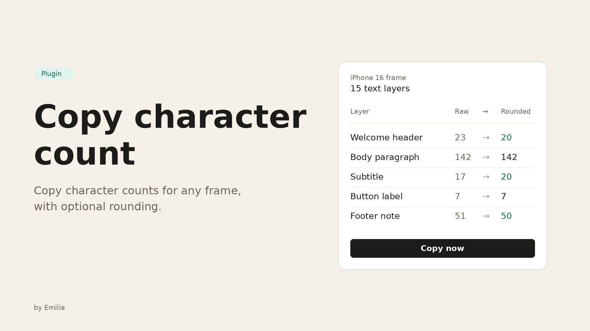

# Copy character count

<p align="center">
  
</p>

A Figma plugin that copies per-text-box character counts from any frame, with optional rounding to the nearest 5. Built for designers and writers who need to communicate copy lengths to engineers, content teams, or QA without leaving Figma.

## Features

- Pick any top-level frame on the current page from a searchable list, or use the canvas selection
- Every text layer shown with its raw character count
- Per-row rounding: **None**, **Round down to nearest 5**, **Round up to nearest 5**
- Bulk controls to apply a rounding mode or toggle every row at once
- Three output formats: plain list, Markdown bullets, or `key: value`
- Live preview of the clipboard contents before you copy
- Unicode-aware: multi-codepoint emoji like 👨‍👩‍👧 count as **1**, not 7

## Install

Clone the repo and build:

```bash
git clone https://github.com/epokta/figma-plugin-copy-character-count.git
cd figma-plugin-copy-character-count
npm install
npm run build
```

The `dist/` folder is already committed, so if you'd rather skip the build step, you can — `manifest.json` points at the pre-built `dist/main.js` and `dist/ui.html`.

Then in **Figma desktop**:

1. Open any design file.
2. `Menu → Plugins → Development → Import plugin from manifest…`
3. Select the `manifest.json` at the root of this repo.
4. Run the plugin from `Plugins → Development → Copy character count`.

## Use

1. Open the plugin.
2. Pick a top-level frame from the searchable list, or click **Use current selection** to refresh based on what's selected in the canvas.
3. The table shows one row per text layer: a checkbox, the layer label, the raw character count, the rounded count, and a per-row rounding mode.
4. Use the bulk controls at the top to apply a rounding mode to every row or toggle every checkbox at once.
5. Pick a **Format** (plain list, Markdown bullets, or `key: value`). The preview updates live.
6. Click **Copy now** to write the preview to your clipboard.

## Repo layout

```
manifest.json         Figma plugin manifest
package.json          Build scripts (esbuild + bundle-ui)
tsconfig.json
src/
  main.ts             Sandbox-side: list frames, count one frame, postMessage to UI
  types.ts            Shared types (TextBoxCount, messages, rounding modes)
  count/
    collect.ts        Walk a frame → TextBoxCount[]
    format.ts         Grapheme count + rounding + preview string builder
  ui.html             Panel markup
  ui.ts               Panel logic, listens for pluginMessage
  ui.css              Styles (uses Figma design tokens via CSS vars)
scripts/
  bundle-ui.js        Inlines ui.css + ui.js into dist/ui.html
dist/                 Pre-built plugin code (committed for one-click sideload)
assets/               README images
```

## Implementation notes

- **Read-only.** The plugin never mutates a single node — it only reads text content and writes to your clipboard. `documentAccess` is set to `dynamic-page`.
- **No network.** `manifest.json` declares `networkAccess: { allowedDomains: ["none"] }`. Nothing leaves your machine.
- **Grapheme-cluster counting.** Counts are computed with `Intl.Segmenter` where available (modern Chromium, which Figma desktop is built on), with a fallback to `Array.from(str).length` for code-point counting. This means `👨‍👩‍👧` is one character, not seven.
- **Hidden layers** are always skipped.
- **State is in-memory only.** Filter state, chosen frame, per-row rounding mode all reset when the panel closes.

## Out of scope

- Editing text from the panel (this stays read-only).
- CSV / file export — Markdown bullets are available in the preview, and you can paste that into anything.
- Settings persistence across files.
- LLM-based suggestions or rewrites.

## License

[MIT](LICENSE).
